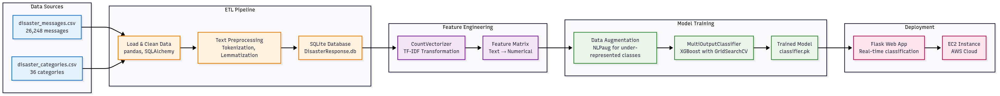

# Disaster Response Analyzer

A machine learning application that classifies emergency messages during disaster events to help coordinate response efforts.

## Overview
This project processes disaster messages and categorizes them into 36 different response categories using natural language processing and machine learning. It includes a web interface for real-time message classification.

## Project Structure
```
Disaster-response-analyzer/
├── app/                    # Flask web application
│   ├── run.py             # Main application file
│   ├── templates/         # HTML templates
│   └── static/           # CSS and assets
├── data/                  # Data processing
│   ├── process_data.py   # ETL pipeline
│   ├── disaster_messages.csv
│   ├── disaster_categories.csv
│   └── DisasterResponse.db
├── models/               # Machine learning
│   ├── train_classifier.py
│   └── classifier.pk
└── requirements         # Dependencies
```

## Backend Workflow



The workflow begins with raw disaster message data that undergoes ETL processing to create a clean, structured dataset. Text data is then transformed into numerical features using TF-IDF vectorization for machine learning. The model training phase includes data augmentation to handle class imbalance and uses XGBoost with hyperparameter tuning for optimal performance. Finally, the trained model is deployed as a Flask web application on AWS EC2 for real-time message classification.

## Installation

1. Clone the repository
   ```bash
   git clone https://github.com/Nishieee/Disaster-response-analyzer.git
   cd Disaster-response-analyzer
   ```

2. Create virtual environment
   ```bash
   python3 -m venv env
   source env/bin/activate
   ```

3. Install dependencies
   ```bash
   pip install -r requirements
   ```

4. Run the application
   ```bash
   python app/run.py
   ```

5. Open http://localhost:3001 in your browser

## Data Processing
The ETL pipeline:
- Loads 26,248 disaster messages from CSV files
- Cleans and preprocesses text data
- Handles multilingual content (English, French, Haitian Creole)
- Converts categories to binary classification format
- Stores processed data in SQLite database

## Machine Learning Model
- **Algorithm**: XGBoost with MultiOutputClassifier
- **Features**: TF-IDF vectorization of preprocessed text
- **Categories**: 36 disaster response classifications including:
  - Emergency response (search & rescue, security, military)
  - Medical aid (medical help, hospitals, medical products)
  - Basic needs (food, water, shelter, clothing)
  - Infrastructure (buildings, electricity, transport)
  - Weather events (floods, storm, fire, earthquake)

## Web Application
- Flask-based interface for message classification
- Interactive visualizations of dataset distribution
- Real-time prediction results
- Word cloud of common terms in disaster messages

## Technologies Used
- **Backend**: Flask, Python
- **ML**: scikit-learn, XGBoost, NLTK
- **Data**: pandas, SQLAlchemy
- **Visualization**: Plotly, matplotlib, wordcloud

## Dataset
- 26,248 disaster messages
- 36 classification categories
- Multiple languages (English, French, Haitian Creole)
- Message sources: direct reports, news, social media

## Author
Nishit Matlani - [GitHub](https://github.com/Nishieee) | [Portfolio](https://www.nishimatlani.xyz)

